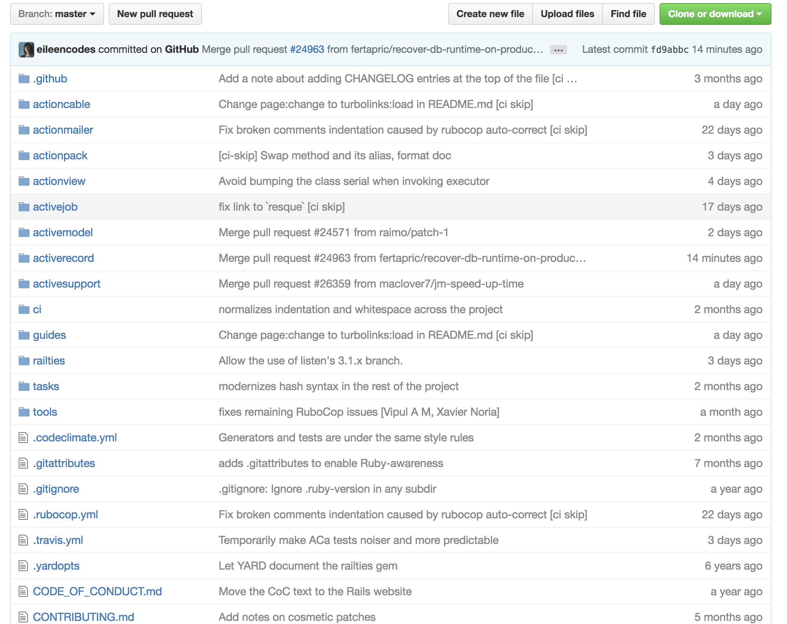
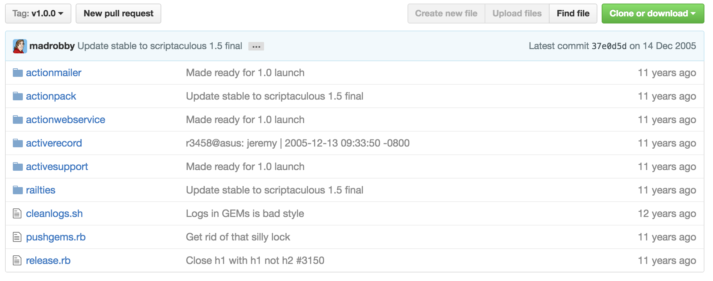
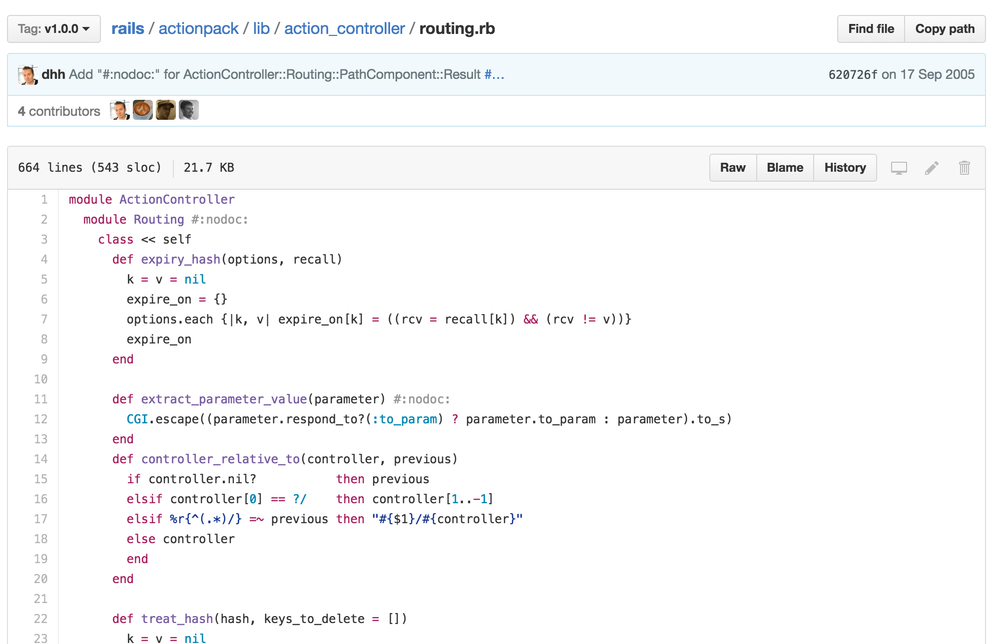
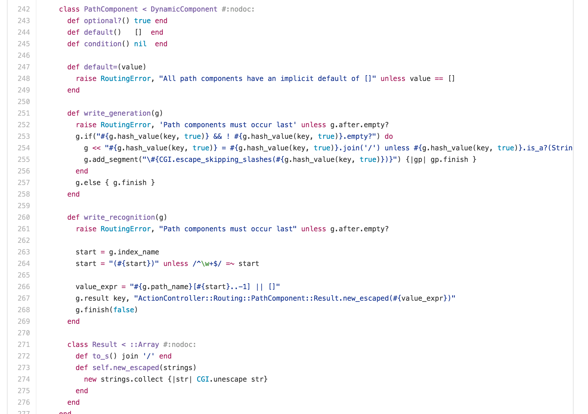
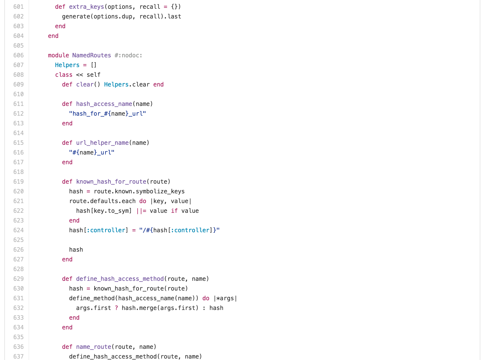
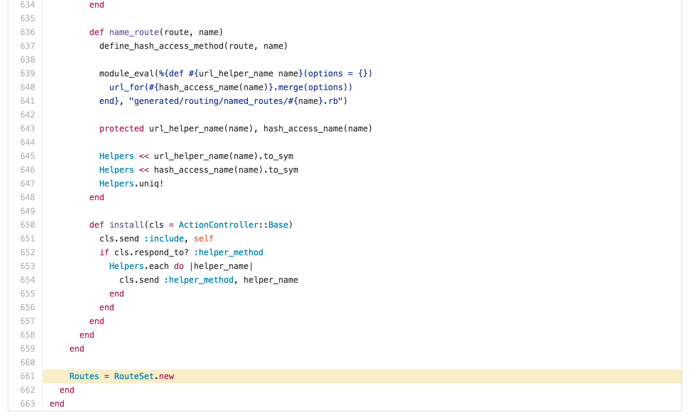

# Reading old Rails

subtitle
:   Rails 1.0 読書会 経過報告

author
:   小林 純一(@junk0612)

place
:   ESM 東京支社

theme
:   lightning-clear-blue

content-source
:   esm_LT

date
:   2016-10-07(Fri)

allotted-time
:   5m

self.introduce
===

- @junk0612
- アジャイル事業部 新入社員
- 好きなもの
  - 食べ物: 麺類
  - ゲーム: ドラクエ
  - git コマンド: reflog

Date.today.topic
===

- Rails1 読書会始めました
- Rails1 のルーティングについて勉強しました **(途中)**

studying.before[1]
===

- Rails 勉強会
  - 道具を知ろう
- 難しくてたいへん
  - 時間が短い
  - 進むスピードが速い

studying.before[2]
===

{:relative_height="20" caption="@t-saito"}

{::blockquote}
僕も結構難しかったんだよね
一緒に僕らのペースで読んでみる？
{:/blockquote}

studying.execute![1]
===

- Rails の現在の master
  - 多い...

{:relative_height="110"}

studying.execute![2]
===

- Rails 1.0
  - これならなんとか読めるかも...？

{:relative_height="110"}

studying.details[1]
===

- rails コマンド
  - 今で言う rails new
  - 新しい雛形プロジェクトを作る
  - 内部に雛形を持っていて、それをコピーしているだけ

studying.details[2]
===

- bin/server
  - 今で言う rails server
  - WEBrick か lighttpd を選んでサーバを立てる
  - デフォルトは WEBrick

studying.details[3]
===

- actionpack/action_controller/routing.rb
  - Rails1 のルーティング
  - RouteSet はあるけど Routes は無いなぁ...？

Routes.present? #=> false
===

- ない...

{:relative_height="110"}

Routes.present? #=> false
===

- ない...

{:relative_height="110"}

Routes.present? #=> false
===

- ない...

{:relative_height="110"}

Routes.present? #=> true
===

- **あった！！！**

{:relative_height="110"}

Routes.behaviour
===

- config/routes.rb に書かれた情報に従ってルーティングを生成
  - なんか黒魔術やってるっぽい **(途中)**

studying.future
===

- Rails1 の解明
- 差分による後継バージョンの学習
- パッチ送りたい！
